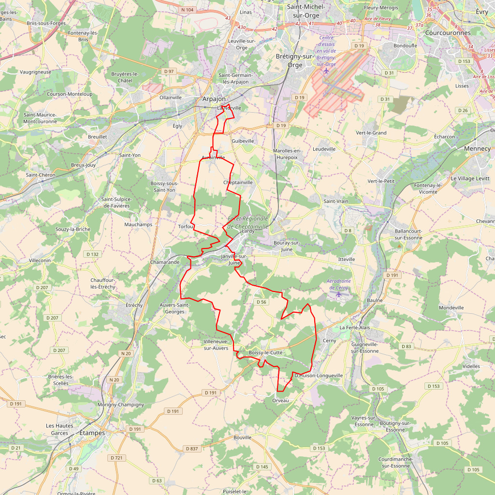

# geojson_to_img

Create an image from a geojson linestring.

## Demo


## Usage
```python
from geojson_to_img import Render

geojson = '{"type":"LineString","coordinates":[[2.257921,48.585854,87.14],[2.258616,48.58588,87.14],[2.258009,48.587399,75.6],[2.255933,48.586365,77.52],[2.252881,48.586563,67.429688],[2.254731,48.584026,91.462524],[2.249013,48.58165,91.46],[2.250155,48.580166,95.788452],[2.250155,48.578194,97.23],[2.246867,48.57233,93.39],[2.246716,48.567307,93.385132]]}'

# First parameter is a geojson as string,
# Second and third are width and height, both are facultative, default is 1024 pixels
r = Render(geojson, 512, 512)

i = r.process()

with open('out.jpg', 'wb+') as f:
	f.write(i)
```